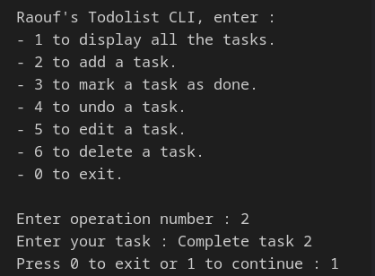
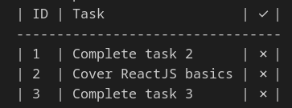
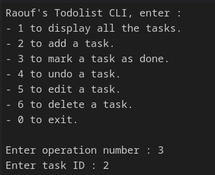
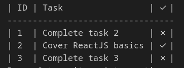

# CLI Todolist Application in TypeScript

A simple command-line interface (CLI) application for managing a todolist, built using TypeScript. It supports adding, listing, completing and removing tasks.

## Running Instructions

1. **Clone the repository:**
   ```bash
   git clone https://github.com/SpeedCode210/A2SV-webdev-task-2
   cd A2SV-webdev-task-2
   ```

2. **Install dependencies:**
   ```bash
   npm install
   ```  

3. **Build the TypeScript code:**
   ```bash
    npm run build
    ```
4. **Run the application:**
    ```bash
    npm start
    ``` 

## Features

- **List Tasks:** View all tasks in the todolist.
- **Add Task:** Add a new task to the todolist.
- **Completing Tasks:** Mark a task as done or not.
- **Edit Task:** Modify the details of an existing task.
- **Remove Task:** Delete a task from the todolist.

## Screenshots









